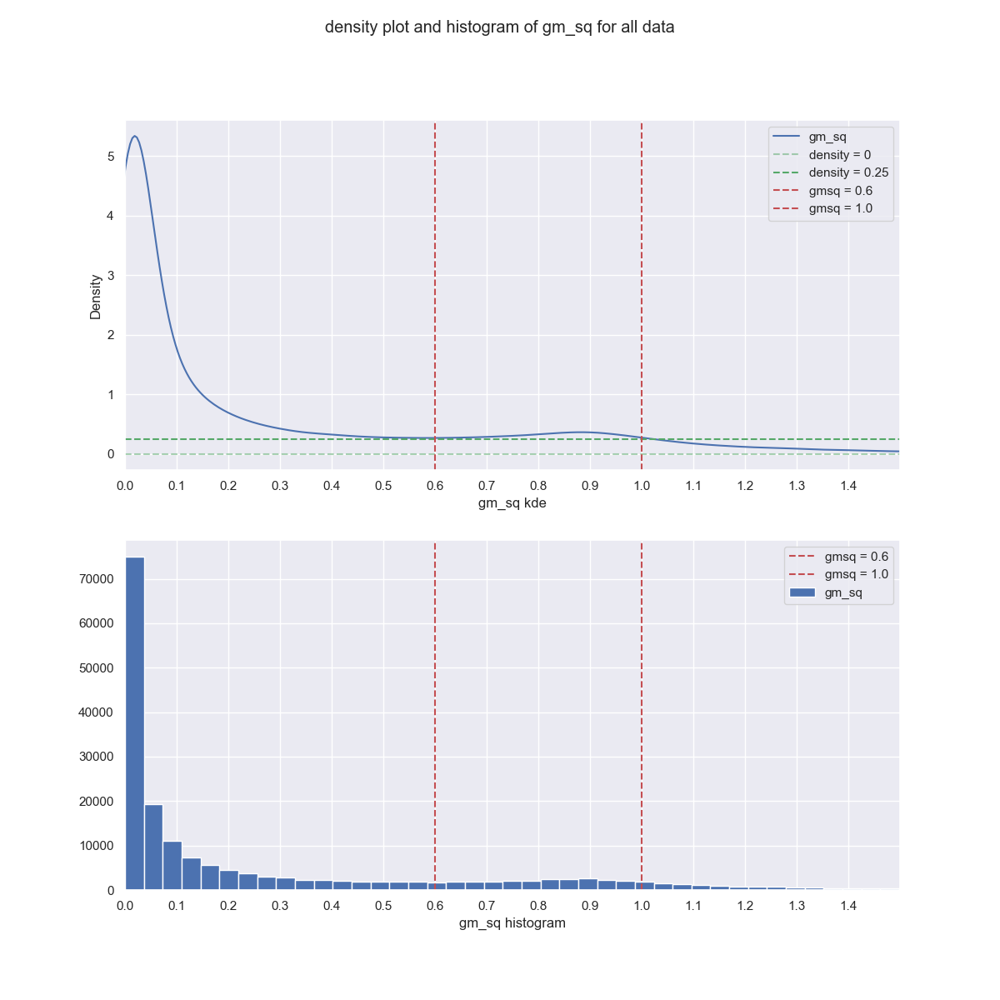
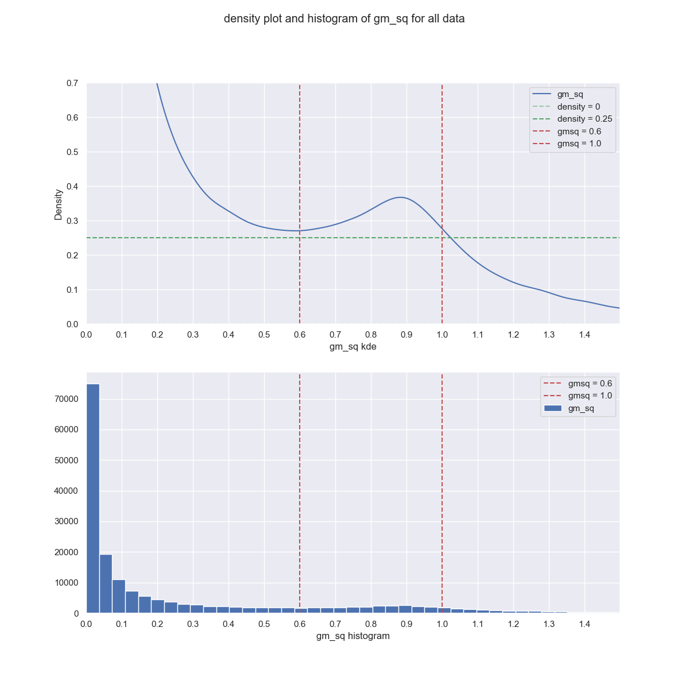

# Notebooks
- [a00_remove_nans_dmstack.ipynb](https://nbviewer.jupyter.org/github/bpRsh/2019_shear_analysis_after_dmstack/blob/master/Nov_2019/nov1_2019/a00_remove_nans_dmstack.ipynb)
- [a01_gmsq_bad_density_plot_nov1.ipynb](https://nbviewer.jupyter.org/github/bpRsh/2019_shear_analysis_after_dmstack/blob/master/Nov_2019/nov1_2019/a01_gmsq_bad_density_plot_nov1.ipynb)

# Introduction
Date: Nov 6, 2019

final_text.txt is created by imcat program after merging four lsst files (m,m9,l,l9) for all 100 data files.
after cleaning.

- DMSTACK gives csv files with lots of nans
- We need to remove nans, and select few columns, and do some filtering.
- After doing cleaning and using IMCAT to combine m,m9,l,l9 text files for 100 files
  I got final_text.txt file which have columns like gm0 and gm1.
- I plotted the number density of gmsq = gm0_sq + gm1_sq and saw that
  there was a bump in the number density when 0.6 < gmsq < 1.0.
- About 10% objects were bad objects (i.e. 0.6 < gmsq < 1.0).


Head of final_text.txt:
```bash
#       fN[0][0]       fN[1][0]       fN[2][0]       fN[3][0]       
id[0][0]       id[1][0]       id[2][0]       id[3][0]           
x[0]           x[1]     
errx[0][0]     errx[0][1]     errx[1][0]     errx[1][1]     errx[2][0]     errx[2][1]     errx[3][0]     errx[3][1]        
g[0][0]        g[0][1]        g[1][0]        g[1][1]        g[2][0]        g[2][1]        g[3][0]        g[3][1]    
shear[0][0]    shear[1][0]    shear[2][0]    shear[3][0]    
flux[0][0]     flux[1][0]     flux[2][0]     flux[3][0]   
radius[0][0]   radius[1][0]   radius[2][0]   radius[3][0]          
gm[0]          gm[1]          gc[0]          gc[1]

cat final_text.txt | wc -l # 183831  we have 183k rows
each row is obtained after combining four files using IMCAT `mergecats 5 m m9 l l9` and finally `catcats all rows`. 
```

Some IMCAT commands used:
```bash
lc -C -n fN -n id -N '1 2 x' -N '1 2 errx' -N '1 2 g' -n shear -n flux -n radius < "${LT}".txt > "${LC}".cat
mergecats 5 "${MC}".cat "${M9C}".cat "${LC}".cat "${L9C}".cat > merge.cat &&

lc -b +all 
'x = %x[0][0] %x[1][0] + %x[2][0] + %x[3][0] + 4 / %x[0][1] %x[1][1] + %x[2][1] + %x[3][1] + 4 / 2 vector' 
'gm = %g[0][0] %g[1][0] + 2 / %g[0][1] %g[1][1] + 2 / 2 vector' 
'gc = %g[2][0] %g[3][0] + 2 / %g[2][1] %g[3][1] + 2 / 2 vector' 
< merge.cat > final/final_${i}.cat

```


The filtering used to get clean text files from unclean dmstack csv files are given below    
#----------------------------------------------------------------------------------------------------
```
original dmstack output: src_lsst90_z1.5_000.csv,   shape = (7610, 167)
add two columns ellip and radius, shape = (7610, 169)
```


```python
cols_imp = ['base_GaussianCentroid_flag',
       'base_GaussianCentroid_flag_resetToPeak', 'base_SdssCentroid_flag',
       'base_SdssCentroid_flag_edge',
       'base_SdssCentroid_flag_almostNoSecondDerivative',
       'base_SdssCentroid_flag_notAtMaximum',
       'base_SdssCentroid_flag_resetToPeak',
       'base_SdssShape_flag_unweightedBad',
       'base_SdssShape_flag_unweighted', 'base_SdssShape_flag_maxIter',
       'ext_shapeHSM_HsmPsfMoments_flag',
       'ext_shapeHSM_HsmPsfMoments_flag_galsim',
       'ext_shapeHSM_HsmSourceMoments_flag',
       'ext_shapeHSM_HsmSourceMoments_flag_galsim',
       'base_CircularApertureFlux_3_0_flag',
       'base_CircularApertureFlux_4_5_flag',
       'base_CircularApertureFlux_4_5_flag_sincCoeffsTruncated',
       'base_CircularApertureFlux_6_0_flag',
       'base_CircularApertureFlux_6_0_flag_sincCoeffsTruncated',
       'base_CircularApertureFlux_9_0_flag',
       'base_CircularApertureFlux_12_0_flag',
       'base_CircularApertureFlux_12_0_flag_apertureTruncated',
       'base_CircularApertureFlux_17_0_flag',
       'base_CircularApertureFlux_17_0_flag_apertureTruncated',
       'base_GaussianFlux_flag', 'base_PsfFlux_flag',
       'base_PsfFlux_flag_edge', 'base_ClassificationExtendedness_flag']

```

**Attempt 1**
Usual filtering:
```
calib_psfCandidate == 0.0
deblend_nChild == 0.0
ellip < 1.5
after filtering, shape = (2315, 169)   # from 7.6k to 2.3k
    
    
    
all objects = 183,832
bad objects = 23,444
bad objects percentage = 12.75% 
```



**Attempt 2**
Use all those 28 filterings.
This gives extremely low number of objects. If we exclude nans there are ZERO
objects. So I will include nans in errx and erry.
```
if all 28 flags == False:
    object is good 
else:
    object is bad (0.6 < gmsq < 1.0)
    
    
all objects = 183,830
bad objects = 23,444
bad objects percentage = 12.75% 
```


**Attempt 3**
Take few columns from 28 features and choose only rows
where these features equal zero.
```
all objects = 183,830
bad objects = 23,444
bad objects percentage = 12.75% 

```


